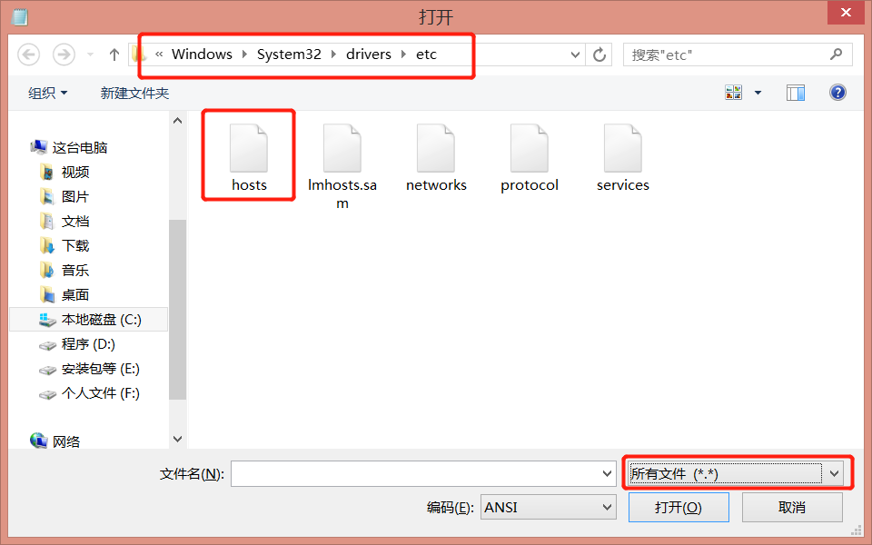
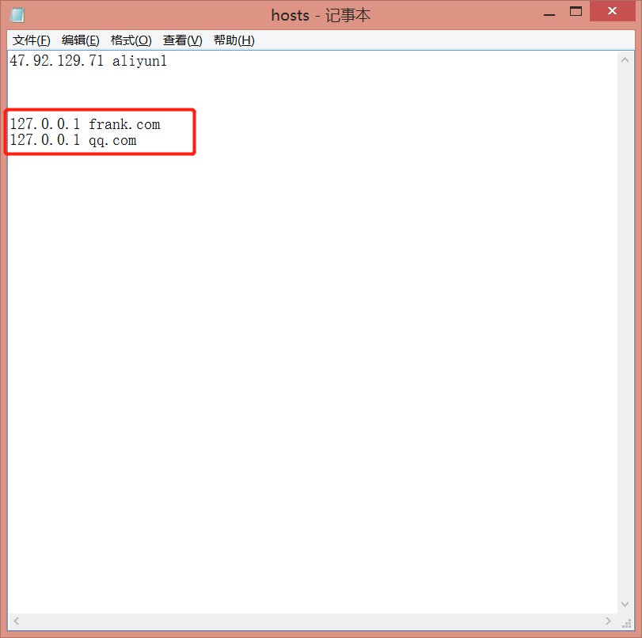

## 简介
新建了两个站点(qq.com 和 frank.com), 前者是模拟的qq空间站点, 里面存放用户的好友列表（friends.json文件）。后者是一个访问网站, 它想获取到前者里面的数据。但是根据浏览器的同源政策, 一般情况下是访问不到的，于是就有两个很常见的解决方案: 方案一：设置Access-Control-Allow-Origin；方案二：JSONP。

## 使用方法：
1. 下载源码到本地
2. 命令行执行`node-dev server.js:端口号`

## 注意：
qq.com的指定端口是8888，frank.com的指定端口是9999。我修改了hosts文件映射：

